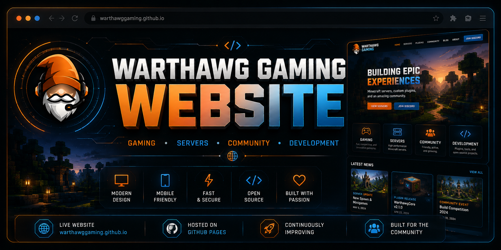

<p align="center">
  
</p>

# Warthawg Gaming Website

Official website repository for Warthawg Gaming.

Live Website:
- https://warthawggaming.com

---

## About

This repository contains the source code and assets for the Warthawg Gaming website hosted using GitHub Pages.

The website acts as the main hub for:

- Gaming content
- Minecraft server projects
- Plugin development
- Community resources
- Development updates
- Branding and project links

---

## Features

- Responsive modern design
- GitHub Pages hosting
- Gaming-focused branding
- Community links
- Project showcases
- Custom navigation system
- Optimized assets and media

---

## Sections

- Home
- About
- Server
- Docs
- Projects
- Social
- Contact

---

## Tech Stack

- HTML5
- CSS3
- JavaScript
- GitHub Pages

---

## Repository Structure

```text
/images
/css
/js
index.html
README.md
```

---

## Branding

This repository uses the Warthawg Gaming developer branding system featuring:

- Minimalist Gnomey logo
- Dark UI aesthetic
- Orange and blue accent colors
- Minecraft-inspired visuals
- Modern gaming/development design

---

## Future Plans

- Expanded documentation
- Project showcase pages
- Embedded media support
- Development blog
- Plugin documentation hub
- Community features

---

## Community

- Website: https://warthawggaming.com
- GitHub: https://github.com/WarthawgGaming
- Twitch: https://www.twitch.tv/warthawggaming
- Discord: https://discord.gg/SFKsPd8YjH

---

## Status

Actively maintained and continuously updated.
